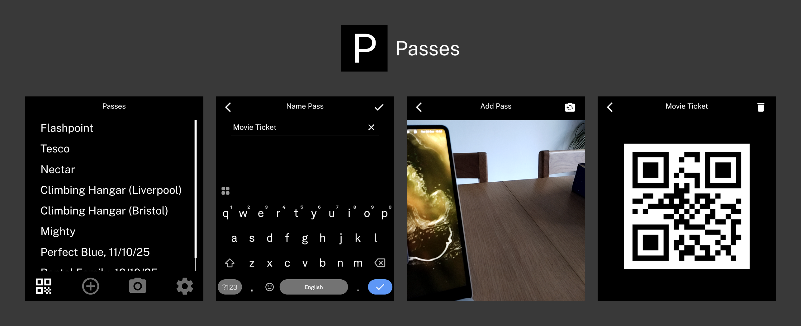

An app for the Light Phone III to store and scan various codes.

## Installation
The lastest .apk file is available in [releases](https://github.com/vandamd/passes/releases/latest).

I recommend using [Obtainium](https://github.com/ImranR98/Obtainium) and adding the repository's URL to receive updates.

## Features
- Reading and saving codes
- Scanning QR codes to open in default browser

Supported codes:
- QR Code
- Aztec Code
- EAN-13
- EAN-8
- PDF417
- UPC-E
- Data Matrix
- Code 39
- Code 93
- ITF-14
- Codabar
- Code 128
- UPC-A

## Support
Passes is developed and maintained in my free time.

If you find it useful, please [consider sponsoring](https://github.com/sponsors/vandamd)! :)
