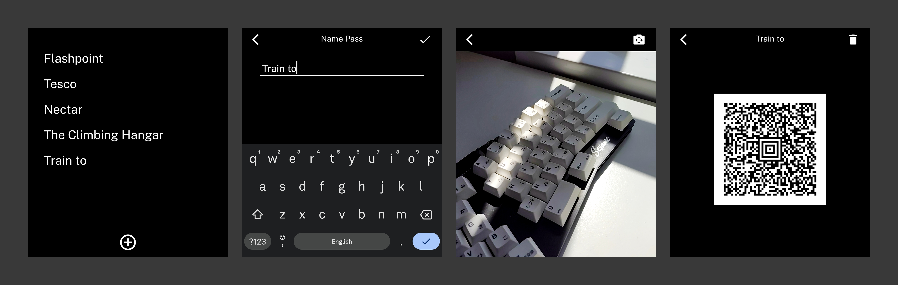

# Passes

An app for the Light Phone III to store codes.

Supported codes:

-   [x] QR Code
-   [x] Aztec Code
-   [x] EAN-13
-   [x] EAN-8
-   [x] PDF417
-   [x] UPC-E
-   [x] Data Matrix
-   [x] Code 39
-   [x] Code 93
-   [x] ITF-14
-   [x] Code 128
-   [x] UPC-A

Font: [Public Sans](https://public-sans.digital.gov/)

## Installation

1. Grab the .apk file from [latest release](https://github.com/vandamd/passes/releases/latest).
2. Install the apk how you like! I prefer via adb, e.g. `adb install passesv1.8.apk`.
3. Profit!

Note: Developer mode needs to be enabled on the Light Phone III to install third-party apps.
